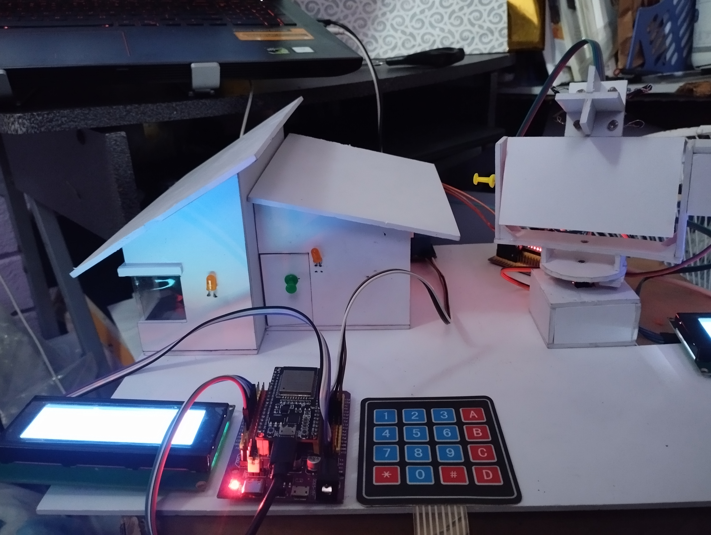
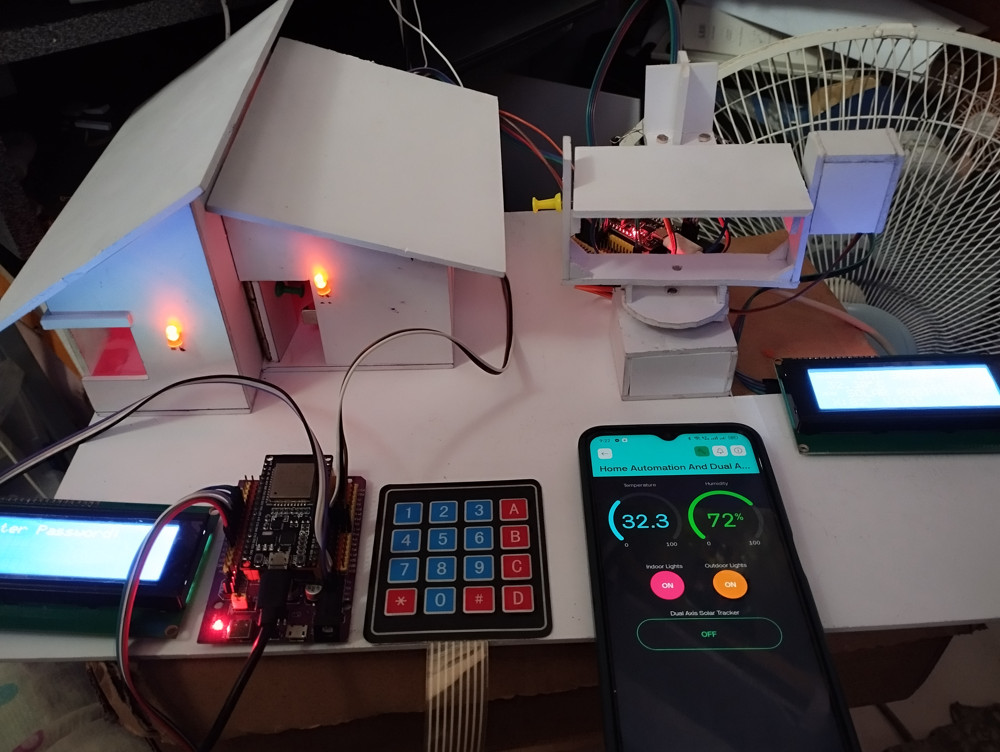
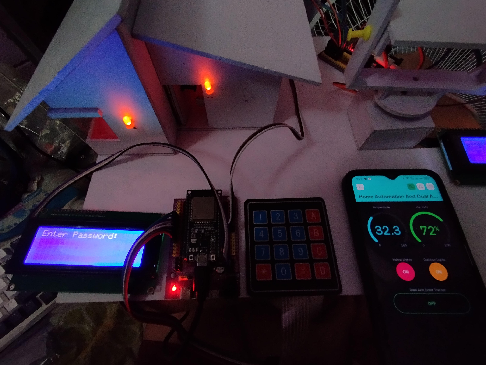
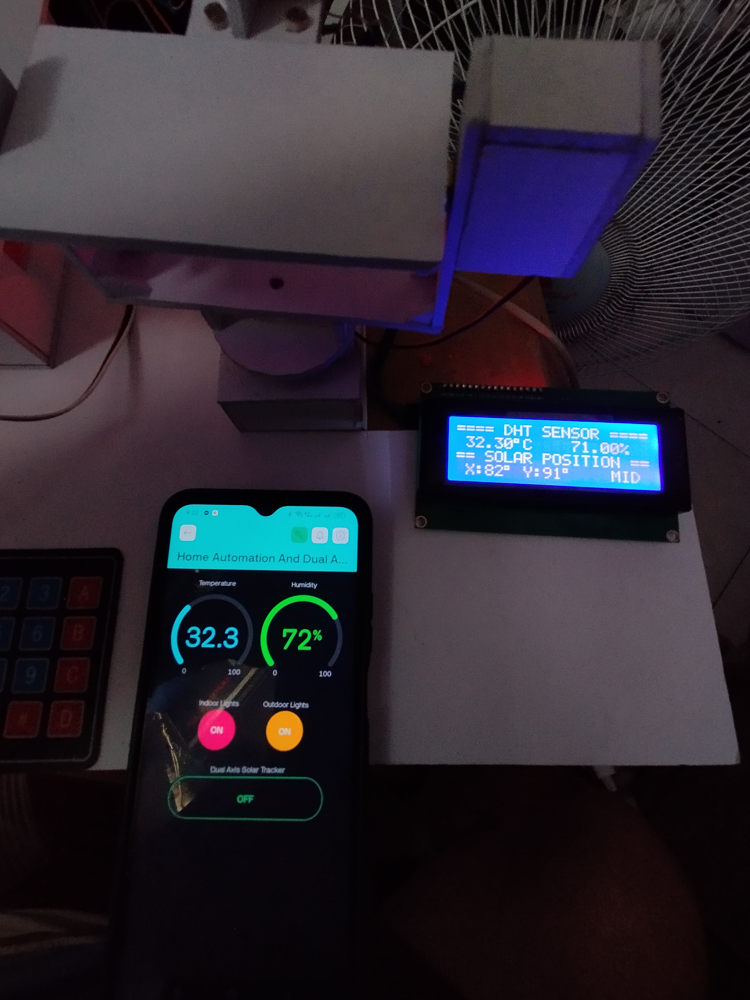

# Embedded Systems Project: Password Lock and Home Automation with Dual Axis Solar Tracker

## Overview
This project integrates a secure Password Lock system with Keypad and Bluetooth functionality, and a Home Automation system featuring a Dual Axis Solar Tracker. 
Created using `PlatformIO` in VSCode.

> [!NOTE]
> For complete concept and documentation of this project, please refer to the links below.
> * [Project Document](https://drive.google.com/drive/folders/1HzYXT0tZSO2F00DSRk3NjnsSb-7ay1pU?usp=drive_link)
> * [Project Photos](https://drive.google.com/drive/folders/1Ntvfde9Eg7RpJcGE7CWHzyPh1vowRfoZ?usp=drive_link)
> * [Project Demo Videos](https://drive.google.com/drive/folders/1u_saFl_buopuT4n0SX_CQjiXXR-XfeTh?usp=drive_link)

### Passcode Lock with Keypad and Bluetooth

#### Components:
- **ESP32** (38 pins with Dev Board)
- **Keypad**
- **LCD I2C 20x4**
- **Solenoid**
- **5V Relay**
- **12V Power Supply** (for Solenoid)

#### Features:
- The lock can be opened via the Keypad or Bluetooth (using Serial Bluetooth terminal).
- Password can be changed by entering Admin mode with an admin password via the `Keypad` or `Bluetooth`.

#### Source Code:
[Passcode Lock with Keypad and Bluetooth](./Passcode%20Lock%20with%20Keypad%20and%20Bluetooth/src/main.cpp)

---
### Home Automation with Dual Axis Solar Tracker

#### Components:
- **2 MG995 Servo Motors** (180 degrees)
- **DHT11 Sensor**
- **ESP32** (38 pins with Dev Board)
- **4 Red LEDs** (Inside the house)
- **2 Orange LEDs** (Outside the house)
- **LCD I2C 20x4**

#### Features:
- Control indoor and outdoor lights.
- Activate and control the Dual Axis Solar Tracker using `Bluetooth` or the `Blynk App`.
- Monitor temperature and humidity via the `LCD`, `BLuetooth Command`, and `Blynk App`.
- Display servo angles and the direction of the light source on the LCD.

#### Source Code:
[Home Automation with Dual Axis Solar Tracker](./Home%20Automation%20with%20Dual%20Axis%20Solar/src/main.cpp)

---

# Project Documentation

